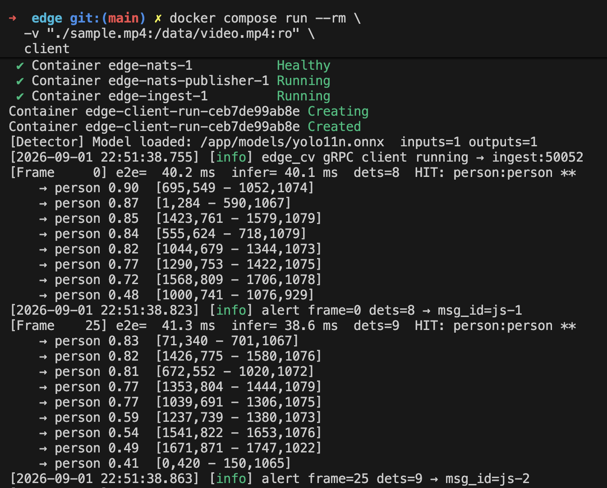
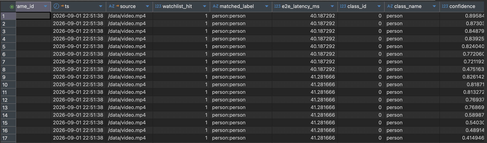

# edge

**Low-latency CV detector pipeline**
video → ONNX YOLO → watchlist alerts → NATS → ClickHouse. 
Built as a systems-level exploration of real-time on-prem recognition flows.

```
┌──────────────┐  grpc   ┌──────────────┐  grpc   ┌──────────────────┐
│ edge_client  │ ──────► │ ingest_server│ ──────► │ nats_publisher   │
│ (CV pipeline)│         │   :50052     │         │     :50051       │
└──────────────┘         └──────────────┘         └────────┬─────────┘
                                                           │ JetStream
                                                           ▼
                                                  ┌─────────────────┐
                                                  │  NATS stream    │
                                                  │  CV_ALERTS      │
                                                  │  subject:       │
                                                  │  cv.alert       │
                                                  └────────┬────────┘
                                       ┌───────────────────┼───────────────┐
                                       ▼                   ▼               
                                  consumer         clickhouse_consumer     
                               (prints alerts)     → cv_detections table   
```
<p align="center">
  
</p>




## Prerequisites

- CMake ≥ 3.20, C++20
- OpenCV, ONNX Runtime
- protobuf + grpc
- NATS server

## Client

Messaging stack:

```bash
./assets/download_model.sh

docker compose up -d

# run client on a video file
docker compose run --rm   -v /path/to/video.mp4:/data/video.mp4:ro   client

# or set VIDEO_FILE as volume mount
VIDEO_FILE=/path/to/video.mp4 docker compose run --rm client
```

## Pipeline

1. **Capture** – OpenCV `VideoCapture` (USB index or file) on its own thread, drop-old queue.
2. **Inference** – ONNX YOLO (letterbox + CHW, NMS inside detector).
3. **Post-process** – confidence floor, class filter, in-memory watchlist.
4. **Alert** → grpc `IngestAlert` (frame_id, boxes, confidence, e2e latency, watchlist hit).

## Stream with grpcurl

```bash
docker compose build --no-cache video_server
...
grpcurl -plaintext -d '{
  "source": "sample.mp4",
  "only_with_detections": false,
  "jpeg_quality": 85
}' localhost:50053 detection.v1.AnnotatedVideoService/StreamAnnotatedVideo

grpcurl -plaintext -d '{
  "source": "sample.mp4",
  "start_frame_id": 0,
  "end_frame_id": 300,
  "fps": 30
}' localhost:50053 detection.v1.AnnotatedVideoService/DownloadAnnotatedVideo
# TODO create downloadable path on minio or such
docker cp 8ff2cd0e42fd:/tmp/annotated_sample.mp4 ./
```

## ClickHouse

Table created by `clickhouse_consumer`:

```sql
CREATE TABLE IF NOT EXISTS cv_detections (
    frame_id         Int64,
    ts               DateTime64(9, 'UTC'),
    source           String,
    watchlist_hit    UInt8,
    matched_label    String,
    e2e_latency_ms   Float64,
    class_id         Int32,
    class_name       String,
    confidence       Float32,
    x1 Float32, y1 Float32, x2 Float32, y2 Float32,
    nats_seq         UInt64,
    ingested_at      DateTime64(3, 'UTC') DEFAULT now64(3)
) ENGINE = MergeTree()
ORDER BY (source, ts, frame_id)
TTL toDateTime(ts) + INTERVAL 90 DAY
```

One row per detection:

```bash
docker exec -it edge-clickhouse-1 clickhouse-client --password pass \
  -q "SELECT class_name, count(), avg(confidence), avg(e2e_latency_ms)
      FROM cv_detections GROUP BY class_name ORDER BY count() DESC"
```